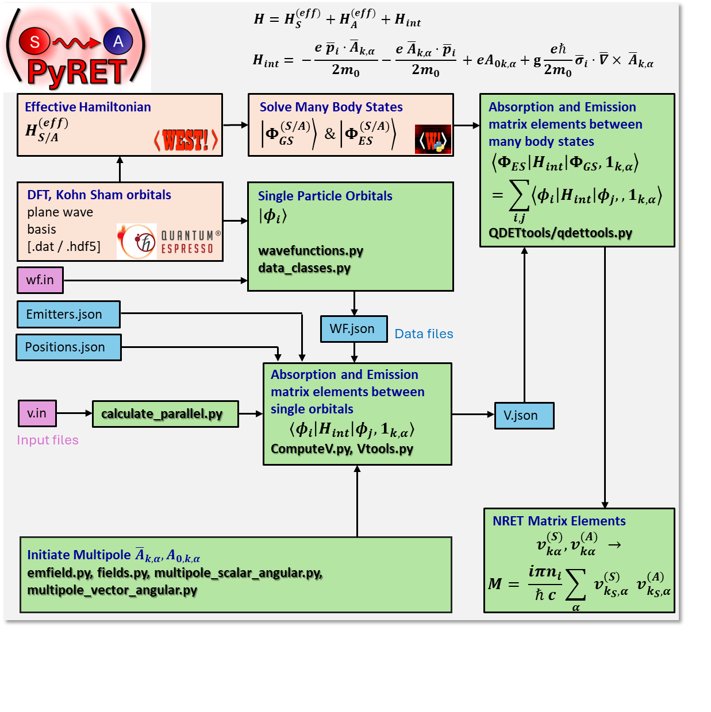

# Welcome to the Github Page of PyRET
PyRET is a python code suit developed for calculation of radiative and nonradiative resonant energy transfer rate between localized defects. 

- It is designed use the outputs of electronic structure codes containing wavefunctions of orbitals and multireferenced localized states of the electrons in the defects. 
- Specifically, **PyRET** can efficiently utilize the single particle wavefunctions computed in the plane wave basis in  Quantum Espresso[https://www.quantum-espresso.org/]. 
- It can also connect to the quantum defect embedding theory calculations of the many-electron states of defects in solids using Quantum Defect Embedding Theory- part of the WEST code [https://west-code.org/].

A detailed flowchart of the partial view of how the various components of this code work is given below.

The theory and computational approach is summarized in our recent two publications:

[1] Chattaraj, Swarnabha, Supratik Guha, and Giulia Galli. “First-Principles Investigation of near-Field Energy Transfer between Localized Quantum Emitters in Solids.” Physical Review Research 6, no. 3 (2024): 033170. https://doi.org/10.1103/PhysRevResearch.6.033170.

[2] Chattaraj, Swarnabha, and Giulia Galli. “Energy Transfer between Localized Emitters in Photonic Cavities from First Principles.” Physical Review Research 7, no. 3 (2025): 033229. https://doi.org/10.1103/8h8j-b79r.

# Installation
To make sure that wavefunctions can be extracted parallely from hdf5 files, h5py needs to be compiled with parallel support.
The installation can be done using pip.

[1] Install pymatgen [https://pymatgen.org/installation.html]

[2] Install PyRET

git clone https://github.com/MICCoMpy/PyRET

cd PyRET

pip install .

[3] Install westpy [https://west-code.org/doc/westpy/latest/installation.html]

# Usage

Refer to the github-page [https://miccompy.github.io/PyRET/] for detailed documentation and usage examples. Also please check the example scripts in the `examples/` directory.

# Authors
Swarnabha Chattaraj (schattaraj@anl.gov) \
Giulia Galli (gagalli@uchicago.edu)

# Acknowledgements
Development of this code was supported by the U.S. Department of Energy, Office of Science, for support of microelectronics research at the Extreme Lithography & Materials Innovation Center (ELMIC), under Contract No. DE-AC0206CH11357. It is done with active collaborative partnership with MICCoM.

